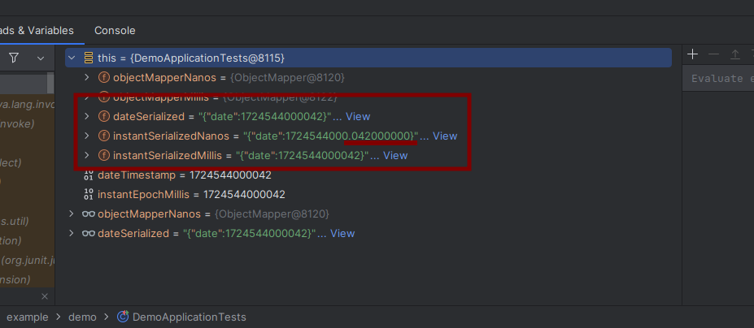
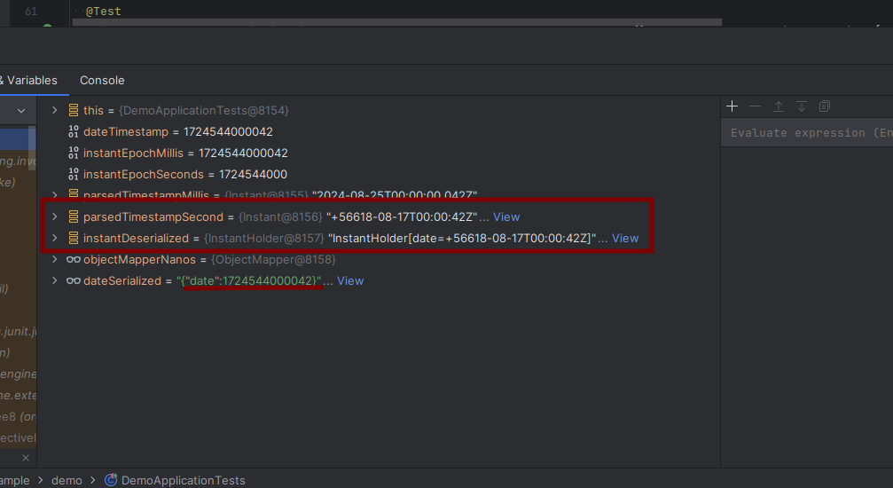

# Jackson Seconds vs Millis vs Nanos (de)serizalization demo

When `READ_DATE_TIMESTAMPS_AS_NANOSECONDS`/`WRITE_DATE_TIMESTAMPS_AS_NANOSECONDS` is enabled (default in spring boot)
the timestamp value is expected in format `<<seconds>>.<<nanos>>`
In this case when `Date` serialized to millis timestamp, `Instant` deserializer reads the integer part as _seconds_,
meaning it's 1000 times larger than expected. See `InstantDeserializer._fromLong` for details

This causes to deserialization as year `56618`:
 

Solution: 
* configure default Jackson deserializer enabling `READ_DATE_TIMESTAMPS_AS_NANOSECONDS`
  <pre>@Bean(name = "objectMapperMillis")
  ObjectMapper objectMapperMillis(Jackson2ObjectMapperBuilder jackson2ObjectMapperBuilder) {
    return jackson2ObjectMapperBuilder
        .featuresToDisable(
            READ_DATE_TIMESTAMPS_AS_NANOSECONDS,
            WRITE_DATE_TIMESTAMPS_AS_NANOSECONDS)
        .build();
  }</pre> 

* spring property: `spring.jackson.deserialization.read-date-timestamps-as-nanoseconds: false`